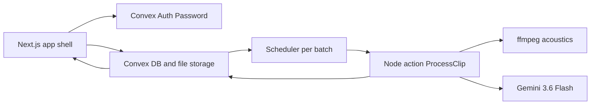
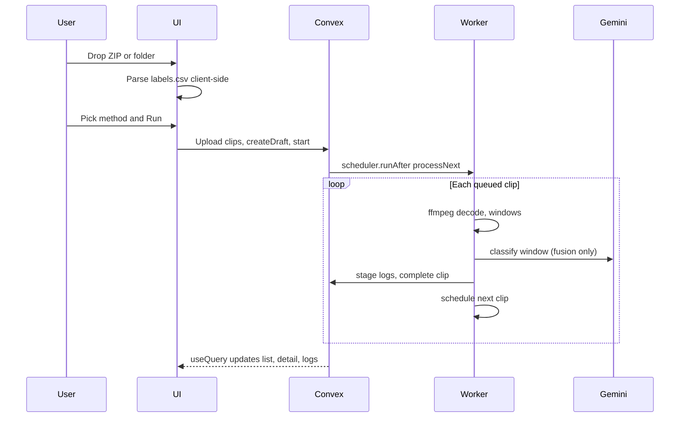

# Architecture

The domain stays a hexagon. Convex is the system of record and the live progress bus. Next.js is a thin operator UI.

## Layers

- `src/domain` — AutoAce JSON codec, fusion, window aggregation, prediction types
- `src/application` — `parseManifestAndFiles`, `processClip`, scoring, method routing
- `convex/` — schema, auth, queries/mutations, scheduler worker
- `src/app` and `src/components` — operator UI
- `src/adapters/cli` — local `npm run analyze` using the same `processClip`

SQLite, cookie login, and the browser `POST /process` loop are gone from the web path. The CLI may still use SQLite on disk for a one-shot run.

## Data

Tables are flat and indexed:

- `batches` — `userId`, `name`, `status` (`draft` | `queued` | `running` | `complete` | `failed`), `method`, `model`, parse issues, counts, timestamps
- `clips` — `batchId`, original `name`, `storageId`, `state`, `stage`, gold/prediction/error JSON, timings
- `logs` — append-only diagnostics keyed by user and batch
- `userSettings` — default method
- Convex Auth tables — users and sessions. No parallel profile table.

Indexes: `by_user`, `by_user_and_created`, `by_batch`, `by_batch_and_created`, `by_status`.

Files go through `generateUploadUrl` into Convex storage. ZIP unzip happens in the browser with JSZip. There is no extra size cap in storage; the parser still enforces clip/batch caps.

## Authz

Every public query and mutation calls `requireUserId` (`getAuthUserId`). Batch and log reads use `ownedOrNull`, so user A cannot read user B's batch. Internal worker mutations are not exposed to the client.

## Sequence of a run

1. Upload parses locally. Empty `result_json` is unlabeled, not fatal. Missing `labels.csv` is fatal.
2. Run creates a draft then starts it. Drafts are not processed.
3. At most two batches run at once. Further starts are `queued`.
4. Clips inside a batch are serialized (Gemini RPM). Separate batches have their own scheduler chains.
5. `onStage` writes decode / acoustics / window i/n / fuse into `clips.stage` and `logs`. A log failure cannot fail the clip.
6. The UI never polls a process endpoint. `useQuery` on batch, clips, and logs is the live stream.

## Failures

Per-clip isolation: one decode or classifier error marks that clip `failed` and the worker continues. Retry failed requeues only those clips. Redo requeues all clips after confirm.

If ffmpeg cannot spawn in the Convex Node action, the clip fails with `decode_failed` and the log records the cause. Predictions are never invented.

## Downloads

CSV and JSON are generated in the browser from the batch query, keyed by the original filename, matching the AutoAce `result_json` codec.
